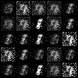
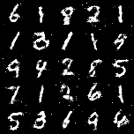
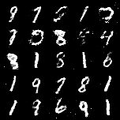
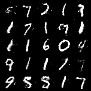
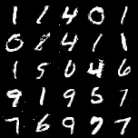

# Basic GAN using PyTorch
> This project is a basic Generative Adversarial Network (GAN) implemented in PyTorch on the MNIST Database

This is one of my initial steps towards GANs in general. This mostly follows from the idea of GAN first published in [arXiv:1406.2661 [stat.ML]](https://arxiv.org/pdf/1406.2661.pdf) by GoodFellow _et.al._

## Getting the code to work

Follow the instructions below to get our project running on your local machine.

1. Clone the repository and make sure you have Python 3 to run the project.
2. Go to `src/PyTorch/` and run `python gan-mnist-pytorch.py`
3. All the outputs and related plots can be found in `src/PyTorch/output` folder generated.
4. The various parameters that can be tweaked before run can be found at `python gan-mnist-pytorch.py --help`

### Prerequisites

* PyTorch 0.4.0 or above
* CUDA 9.1 (or other version corresponding to PyTorch) to utilize any compatible GPU present for faster training

### Results

  

Images generated by Generator at various epochs - 

	|		|	
:----------------------------------------------------------------------:|:-------------------------------------------------------------------------:|:--------------------------------------------------------:
Generated on Epoch 0													|	Generated on Epoch 40													|	Generated on Epoch 80
	|		|	
Generated on Epoch 120													|	Generated on Epoch 160													|	Generated on Epoch 200

